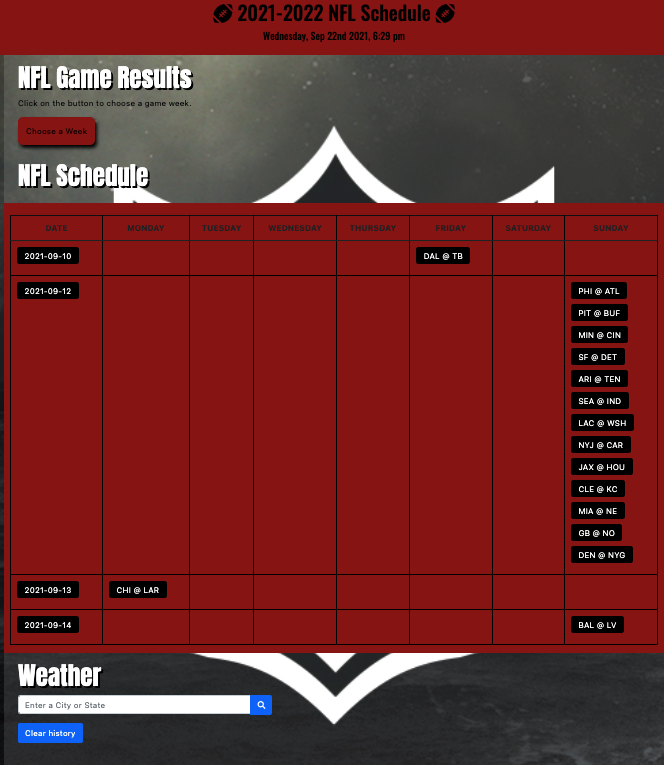

# BootCamp-Project-One

## Description

Create an NFL Dashboard, so when you click on a week you can see the games that are being played in a calendar view and what teams are playing. You can also enter the city a game is occurring and view the weather, so you can make sure to wear and bring the right equipment to the game.

## Installation

Website can be accessed through ChonaC github profile via URL.

## Usage

Website is dynamic and can be viewed on any screen size and meets all standards for accessibility.
link: https://chonac.github.io/BootCamp-Project-One/

## Credits

Used information from:
https://openweathermap.org/api
 
https://getbootstrap.com/docs/5.1/getting-started/introduction/
 
http://www.espn.com/apis/devcenter/docs

## How to Contribute

Add input fields so when you click on a game you can enter the score and key information about the players, teams or how the game went. 
Add players and their stats to the application. 
Add live updates with the score of the game and what quarter and time during the quarter the teams are in. 
Be able to customize the site based on your favorite team. 
